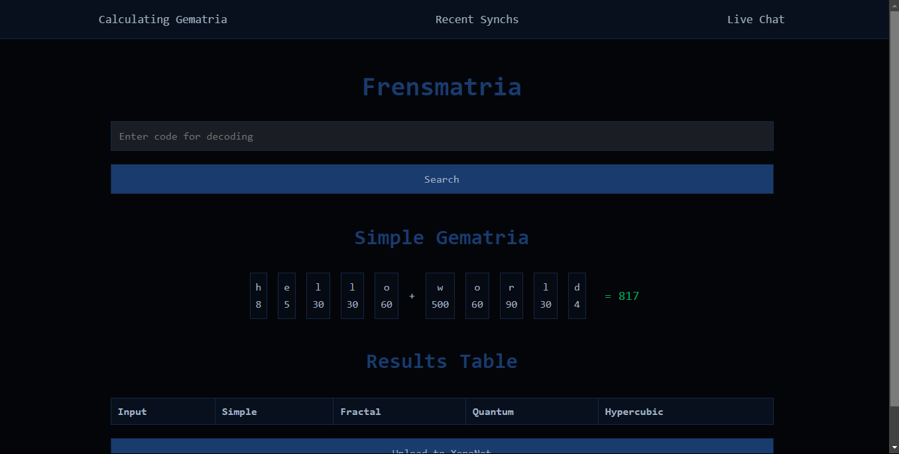

# Frensmatria

Welcome to **Frensmatria** – an innovative peer-to-peer (P2P) network dedicated to exploring and expanding gematria knowledge through collaborative nodes and a unified relay system.

Currently in development

## Getting Started

To get involved, you can start by running the `nodes/main.go` file. At this point, the primary focus is on the website and database structure, so the P2P features are not yet available for testing. 

## Key Features

- **Node Communication**: Enables nodes to connect and share information.
- **SDP Relay System**: Facilitates sharing of SDP descriptors for P2P connectivity.
- **Connection Management**: Supports multiple connections across the network.
- **Event Handling**: Manages real-time updates and communication events.
- **Gematria Calculations**:
  - Synx
  - Alphanumeric Qabbalah
- **Web Interface**:
  - Interactive gematria calculator
  - Recent results display
- **Database Integration**: Stores gematria results for future access.
- **Node Information Sharing**: Allows for the exchange of events and data across nodes.

## Roadmap

Here's a list of completed and planned features:

- [x] **Node Communication**
- [x] **Relay for SDP Sharing**
- [x] **Multi-Connection Management**
- [x] **Event Handler**
- [x] **Gematria Calculations** (Synx and Alphanumeric Qabbalah)
- [x] **Web Interface** (for calculating and viewing gematria results)
- [ ] **Simple Chat** *(under consideration; may be removed)*
- [x] **Database Integration**
- [ ] **Authentication** (for secure access between nodes)
- [ ] **Additional Relays** (to enhance P2P connectivity)
- [ ] **Error Correction** with Solomon Codes

## Upcoming Enhancements

- Improvements to relay functionalities
- Expanded system for adding and sharing node information

Thank you for your interest in Frensmatria! Stay tuned for more updates as we continue developing this platform.

[normie.webm](https://github.com/user-attachments/assets/b3b53278-b24c-48ba-8cdb-d1e5f1a99379)
